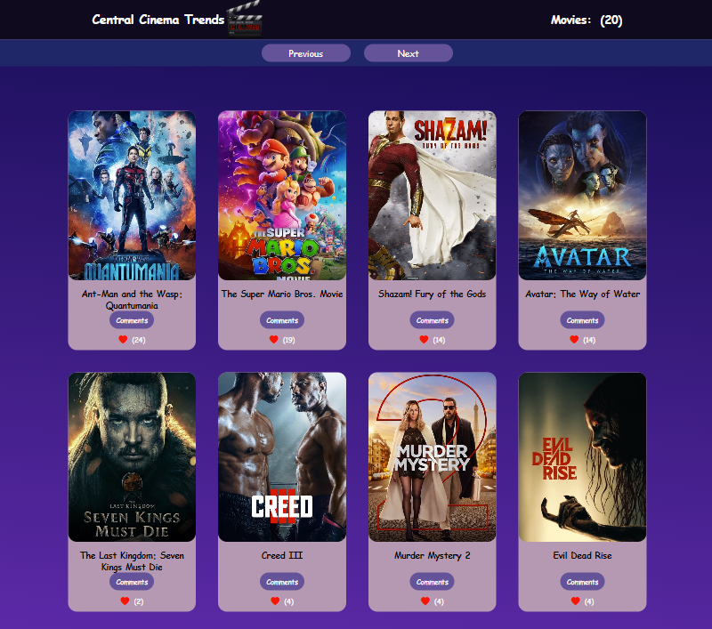

<a name="readme-top"></a>


<div align="center">

  <h1><b>Central Cinema Trends: JavaScript Capstone Project </b></h1>
  

</div>

<!-- TABLE OF CONTENTS -->

# 📗 Table of Contents

- [📗 Table of Contents](#-table-of-contents)
- [📖 Central Cinema Trends - JavaScript capstone project - Your API-based webapp](#-central-cinema-trends---javascript-capstone-project---your-api-based-webapp)
  - [🛠 Built With ](#-built-with-)
    - [Tech Stack ](#tech-stack-)
    - [Key Features ](#key-features-)
  - [🚀 Live Demo ](#-live-demo-)
  - [💻 Getting Started ](#-getting-started-)
    - [Prerequisites](#prerequisites)
    - [Setup](#setup)
    - [Install](#install)
    - [Usage](#usage)
    - [Run tests](#run-tests)
    - [Deployment](#deployment)
  - [👥 Authors ](#-authors-)
  - [🔭 Future Features ](#-future-features-)
  - [🤝 Contributing ](#-contributing-)
  - [⭐️ Show your support ](#️-show-your-support-)
  - [🙏 Acknowledgments ](#-acknowledgments-)
  - [📝 License ](#-license-)

<!-- PROJECT DESCRIPTION -->

# 📖 Central Cinema Trends - JavaScript capstone project - Your API-based webapp<a name="about-project"></a>


**Central Cinema Trends** is a webapp that shows you the most popular movies. We built this webapp as part of our currently studies at Microverse in the Full-Stack Web Development program. This is our JavaScript capstone project. To Build this web application we use an external API provided by [The Movie DB](https://www.themoviedb.org/). 

In this web application, users can interact whit it, posting comments and given likes for each movie. To do that, we use the [Involvement API](https://www.notion.so/microverse/Involvement-API-869e60b5ad104603aa6db59e08150270) provided by Microverse.


## 🛠 Built With <a name="built-with"></a>

### Tech Stack <a name="tech-stack"></a>


<details>
  <summary>HTML</summary>
  <ul>
    <li>HTML</li>
  </ul>
</details>

<details>
  <summary>CSS</summary>
  <ul>
    <li>CSS</li>
  </ul>
</details>

<details>
  <summary>Javascript</summary>
  <ul>
    <li>Javascript</li>
  </ul>
</details>

<!-- Features -->

### Key Features <a name="key-features"></a>

- Use of linters on HTML&CSS&JavaScript project.
- Write a correct descriptive README file.
- Use of webpack.
- Follow GitFlow.
- Use of JavaScript to make websites dynamic and build basic single page apps.
- Use of ES6 syntax.
- Use of ES6 modules.
- Use of callbacks and promises.
- Apply JavaScript best practices and language style guides in code.
- Use AAA pattern for unit tests.
- Write units tests for a JavaScript app, and use of Jest tool for these tests..
- Solve simple git conflicts.
- Send and receive data from an API.
- Use API documentation.
- Understand and use JSON.
- Make JavaScript code asynchronous.
- Perform a code review for a team member.

<p align="right">(<a href="#readme-top">back to top</a>)</p>

<!-- LIVE DEMO -->

## 🚀 Live Demo <a name="live-demo"></a>

- Here is a [livedemo](https://oovillagran.github.io/Capstone-Module2/dist/index.html).
- Here is a [video](https://drive.google.com/file/d/1UMheuoNDptDJuiILqZK88ZOEy38p4MSx/view?usp=sharing) with the main features of the project we built.

<p align="right">(<a href="#readme-top">back to top</a>)</p>

<!-- GETTING STARTED -->

## 💻 Getting Started <a name="getting-started"></a>

To get a local copy up and running, follow these steps:

 ```bash
 clone this repository into your machine
 npm start
```

### Prerequisites

In order to run this project you need:

- Create a repo on your repositores files.
- Clone or make a copy of this repo on your local machine.
- Follow GitHub flow.
- A carefully reading of this README.md is required.

### Setup

Clone this repository to your desired folder:
 
 ```bash
 cd my-folder
 git clone git@github.com:oovillagran/Capstone-Module2.git
```

### Install

Install this project with:

 ```bash
 npm install
```

### Usage

To run the project, you can use your favorite browser.


### Run tests

To run tests, execute the following command:

```bash
 npm test
```

### Deployment

- N/A

<p align="right">(<a href="#readme-top">back to top</a>)</p>

<!-- AUTHORS -->

## 👥 Authors <a name="authors"></a>

👤 **Naan Ahmed Mohammed**

- GitHub: [@naanmohammed](https://github.com/naanmohammed)
- Twitter: [@_naanahmed](https://twitter.com/twitterhandle)
- LinkedIn: [naanahmed](https://linkedin.com/in/naanahmed)

👤 **Oscar Villagran**

- GitHub: [@oovillagran](https://github.com/oovillagran)
- Twitter: [@oovillagran](https://twitter.com/oovillagran)
- LinkedIn: [Oscar Villagran](https://www.linkedin.com/in/oovillagran/)


<p align="right">(<a href="#readme-top">back to top</a>)</p>

<!-- FUTURE FEATURES -->

## 🔭 Future Features <a name="future-features"></a>


- [ ] **Make Reservations Options**


<p align="right">(<a href="#readme-top">back to top</a>)</p>

<!-- CONTRIBUTING -->

## 🤝 Contributing <a name="contributing"></a>

Contributions, issues, and feature requests are welcome!

Feel free to check the [issues page](../../issues/).

<p align="right">(<a href="#readme-top">back to top</a>)</p>

<!-- SUPPORT -->

## ⭐️ Show your support <a name="support"></a>


If you like this project feel free to make any comment, all contributions are welcome!.

<p align="right">(<a href="#readme-top">back to top</a>)</p>

<!-- ACKNOWLEDGEMENTS -->

## 🙏 Acknowledgments <a name="acknowledgements"></a>

We would like to thank Microverse comunity. We thank our learning, morning session and standup partners for supporting us.

<p align="right">(<a href="#readme-top">back to top</a>)</p>

## 📝 License <a name="license"></a>

This project is [MIT](LICENSE.md) licensed.

<a href="LICENSE.md">

<p align="right">(<a href="#readme-top">back to top</a>)</p>
